# Project Report: DocuLingua

**GROUPE MEMEBERS**: **Amirarsalan Sanati**, **Diptaraj Sen**

## 1. Project Idea

DocuLingua is a Python and Streamlit application that helps language learners study a foreign-language document by turning uploaded PDF or TXT content into a structured learning guide. The current repository focuses on French source documents with English explanations, and the intended users are learners who want vocabulary, grammar, phrases, exercises, and review material from real texts rather than generic textbook examples.

The application extracts and cleans document text locally, prepares document statistics and chunks, generates learning sections through configurable LLM providers, and exports a static PDF workbook. The repository uses Streamlit for the user interface, PyMuPDF for PDF text extraction and fallback PDF generation, optional WeasyPrint rendering, Pydantic models for guide structure, Groq and Gemini provider adapters for LLM output, python-dotenv and pydantic-settings for configuration, and pytest for automated tests.

## 2. Achieved Tasks and Features

- Supports document input through Streamlit file upload and previously stored uploads.
- Accepts `.pdf` and `.txt` files and rejects unsupported file extensions.
- Extracts PDF text with PyMuPDF and reads TXT files as UTF-8 text.
- Cleans text, chunks content, and calculates document statistics such as characters, words, paragraphs, unique words, and estimated reading time.
- Provides a Streamlit preview workflow with metrics, cleaned text preview, and first chunk preview.
- Generates learning-guide sections for overview, key vocabulary, important verbs, grammar patterns, useful phrases, mini lessons, practice exercises, reading practice, review sheet, and answer key.
- Uses a provider router that tries configured LLM providers in order, with Groq as the primary provider and Gemini as fallback by default.
- Parses JSON responses, validates section data with Pydantic-backed structures, records provider/model metadata, and reports failed sections.
- Includes optional final guide polishing through additional LLM calls.
- Renders a downloadable static PDF guide using WeasyPrint when available and PyMuPDF as a fallback.
- Stores uploads and generated PDFs locally under `app/storage/`.
- Provides API key settings in the Streamlit interface and supports `.env` configuration.
- Includes automated pytest coverage for document loading, text cleaning, chunking, provider routing, response parsing, guide generation, PDF building, progress tracking, and schemas.

## 3. Software Development Principles Followed

- **Modularity:** The project separates UI, core processing, learning content generation, LLM providers, PDF rendering, and utilities into distinct modules.
- **Separation of concerns:** `streamlit_app.py` handles interaction, `app/core/` handles document processing, `app/learning/` handles guide content, `app/llm/` handles prompts and providers, and `app/pdf/` handles PDF output.
- **Design modeling:** Created design models (usecase, sequence, architecture etc.) following design modeling principles.
- **Complying with principels guiding process**: Create somethign which brings value for the user.
- **Single responsibility:** Individual helpers such as document loaders, text cleaners, response parsers, provider adapters, and PDF builders each focus on one main responsibility.
- **Configuration management:** API keys, model names, provider order, and project settings are loaded through `.env` and `pydantic-settings`.
- **Input validation:** Supported file types are checked, TXT decoding errors are handled, and LLM output is validated before being accepted into the guide.
- **Error handling and fallback:** The provider router records failed attempts, retries invalid JSON, falls back from Groq to Gemini, and the PDF builder falls back from WeasyPrint to PyMuPDF.
- **Extensibility:** New LLM providers can be added by implementing the provider interface and registering them with the router.
- **Testing:** The `tests/` directory contains focused pytest cases that cover local processing and mocked provider behavior without requiring real API calls.
- **Continuous Integration:** CI practices were involved during the development of the software: Regular and granular commits (pushs), unit testing, fall back, github workflows, github actions etc.
- **Documentation:** The README explains the project goal, setup, environment variables, run command, provider design, and current MVP status.

## 4. Demo and Repository Information

- Repository link: https://github.com/diptaraj23/DocuLingua
- Run command:

```powershell
python -m venv .venv
.venv\Scripts\Activate.ps1
pip install -r requirements.txt
Copy-Item .env.example .env
streamlit run streamlit_app.py
```

- Required dependencies are listed in `requirements.txt`: Streamlit, Groq, Google GenAI, python-dotenv, Pydantic, pydantic-settings, PyMuPDF, spaCy, pytest, and WeasyPrint.
- Required environment variables for LLM generation include `GROQ_API_KEY` and optionally `GEMINI_API_KEY`. Model and provider settings are also configurable in `.env`.
- LLM generation requires at least one configured API key. The PDF renderer can use PyMuPDF if WeasyPrint native dependencies are unavailable.

## 5. Annexes 
In this part, we introduce and explain different diagrams illustrating the design of the system.


### Annex A: UML and architecture diagrams.

#### Use Case Diagram

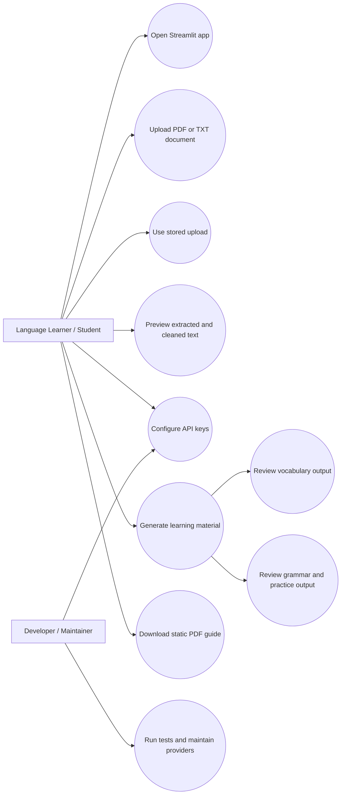

This diagram shows the main learner actions: opening the Streamlit app, uploading or selecting a document, previewing extracted text, configuring API keys, generating learning material, and downloading the final PDF. It also includes developer maintenance actions such as running tests and managing providers.

#### Class / Module Diagram

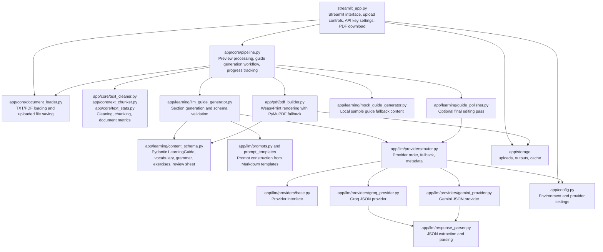

This diagram represents the repository as cooperating modules. The Streamlit UI calls the core pipeline, the pipeline uses document loading and text processing helpers, the learning layer builds Pydantic-based guide structures, the provider router manages Groq and Gemini adapters, and the PDF builder writes the final workbook.

#### Sequence Diagram

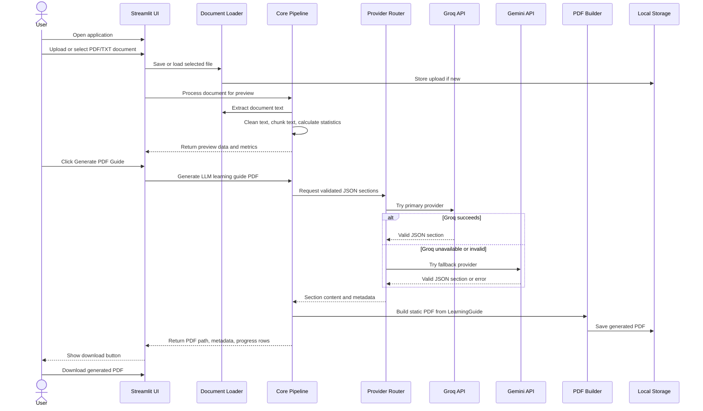

This diagram follows the main application workflow from opening DocuLingua through document upload, local extraction, preview generation, LLM section generation, static PDF creation, and final download.

#### Architecture Diagram

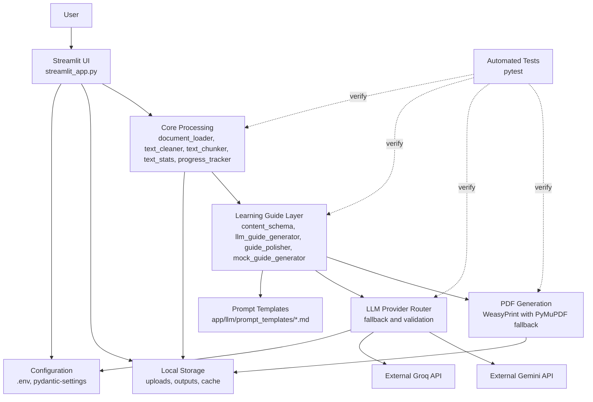

This diagram summarizes the runtime architecture: Streamlit UI, configuration, local storage, core processing, learning-guide generation, prompt templates, provider routing, external LLM APIs, PDF generation, and pytest coverage.

#### Database / Storage

The inspected repository does not contain a database schema, ORM configuration, migration files, or database service configuration. DocuLingua stores files locally instead:

- Uploaded source documents are stored under `app/storage/uploads/`.
- Generated PDF learning guides are stored under `app/storage/outputs/`.
- Cache-related placeholder storage exists under `app/storage/cache/`.
- Runtime configuration is stored in `.env`.

Because the MVP does not use a database, an ER diagram is not applicable. A local storage view is included in the architecture diagram.

The project does not use a database. Local file storage is used for uploads, generated PDFs, cache placeholders, and environment configuration.

## Annex B: Screenshot placeholders.
In this section, we will showcase some screenshots from the software itself, to better demonstrate the developed product and its capabilities:

### Main page, main functionalities.

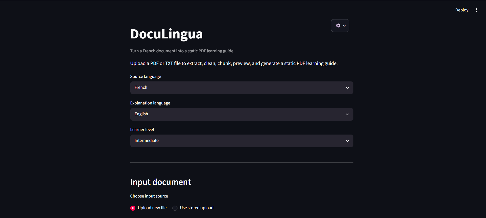

Here, is the user input interface:

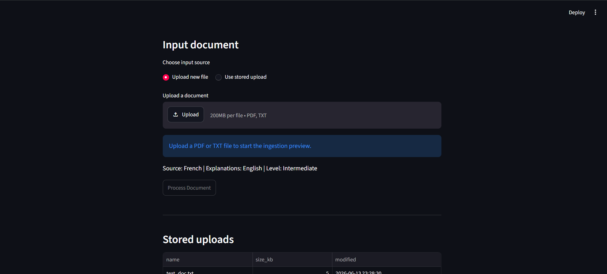

There's an option for the user to select previously uploaded docs (for regeneration):

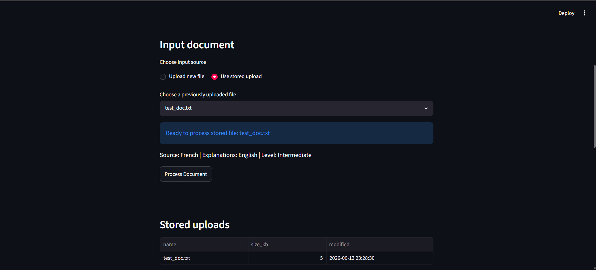

And you can also choose to delete your previously uploaded documents:

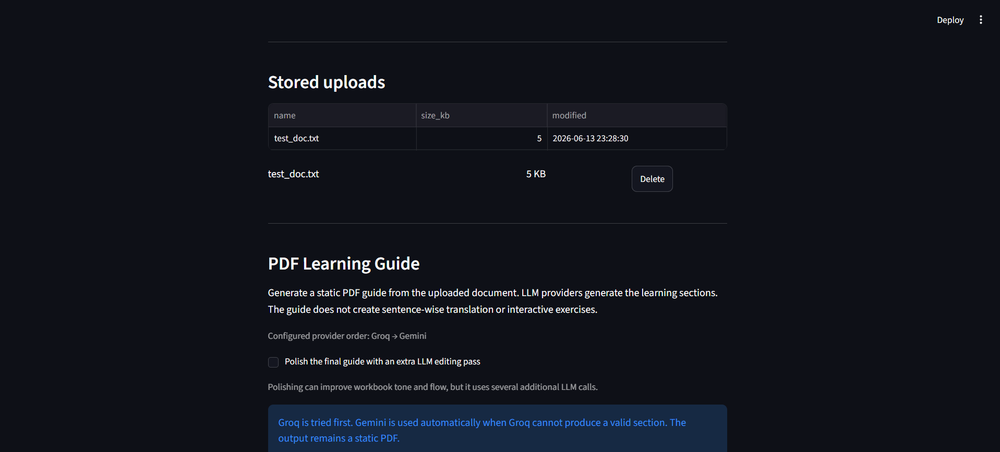

Here, is the learning guide pdf generation user interface:

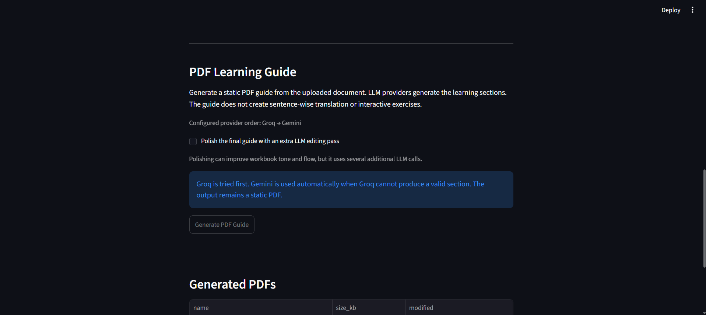

And of course you can see and manage previously generated materials:

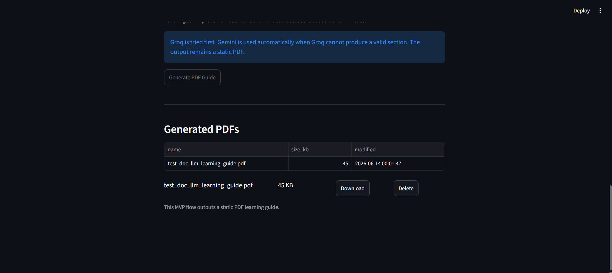

### API Settings.

User can change their api keys without having to directly edit '.env' file:

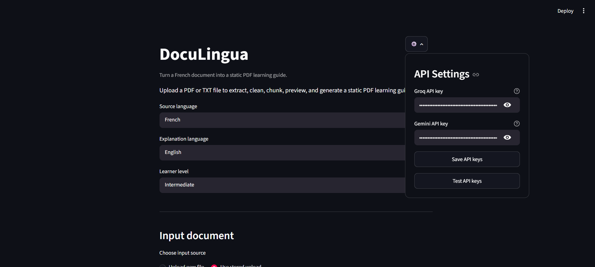

User can save, or test the connectivity and authenticity and responsiveness of the keys:

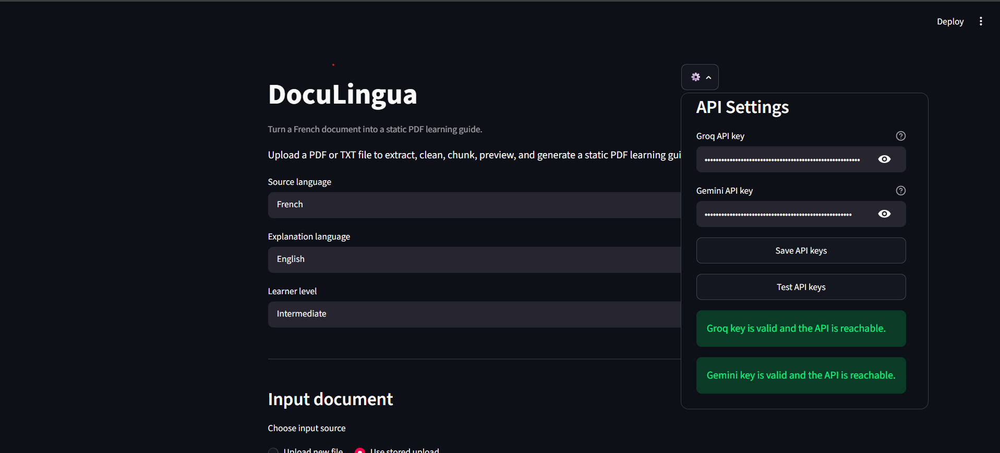

### Sample run.

After uploading document, the uploaded material will be processed and user will be given some stats regarding the doc:

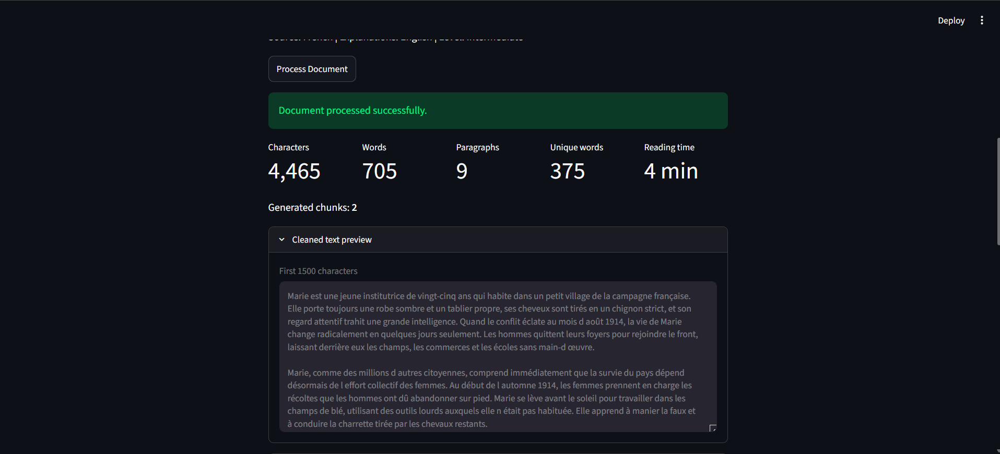

User can see the learning guide generation progress, its pipeline, and its current stage, along with the time took to complete the task and the model used by software to complete it.

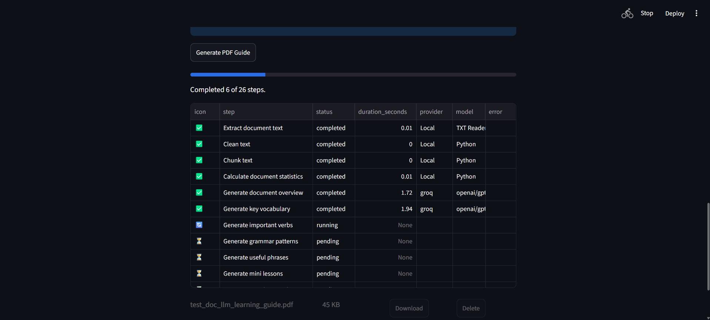

After generation is complete, user can download the generated document. Moreover, generation report will be shown to the user:

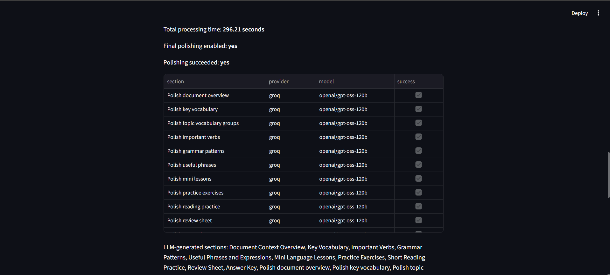
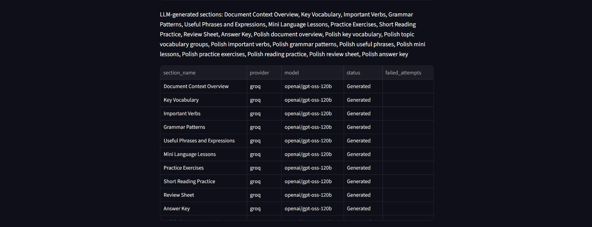
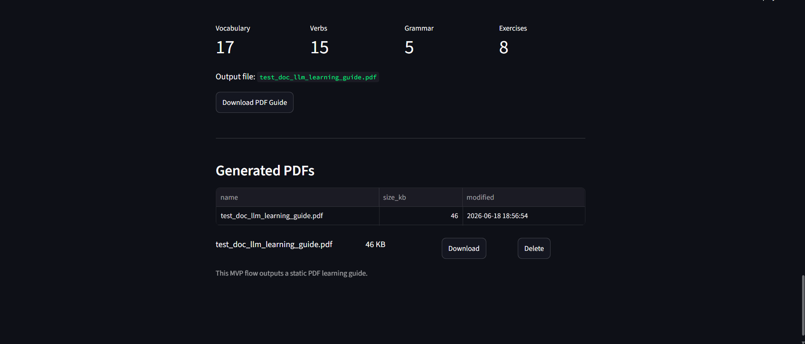

### See the generated document.

The followign images will showcase a sample generated pdf guide for the uploaded French document, you can see the table of contents, and some sectiones of it. The pdf and the French document is available in the github repository:

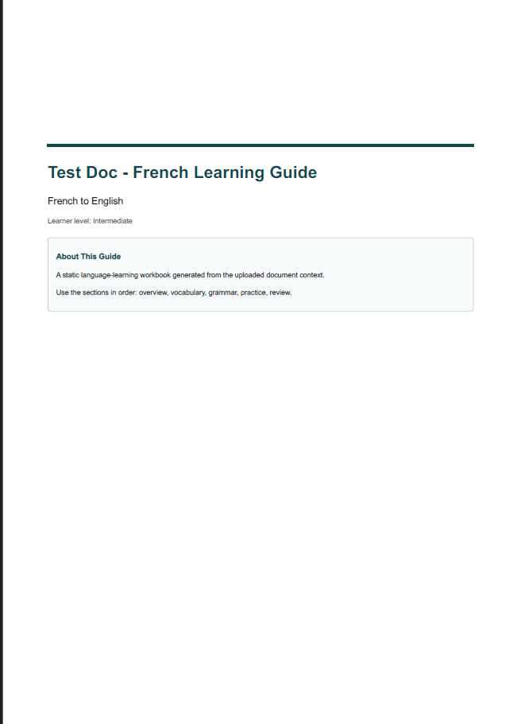
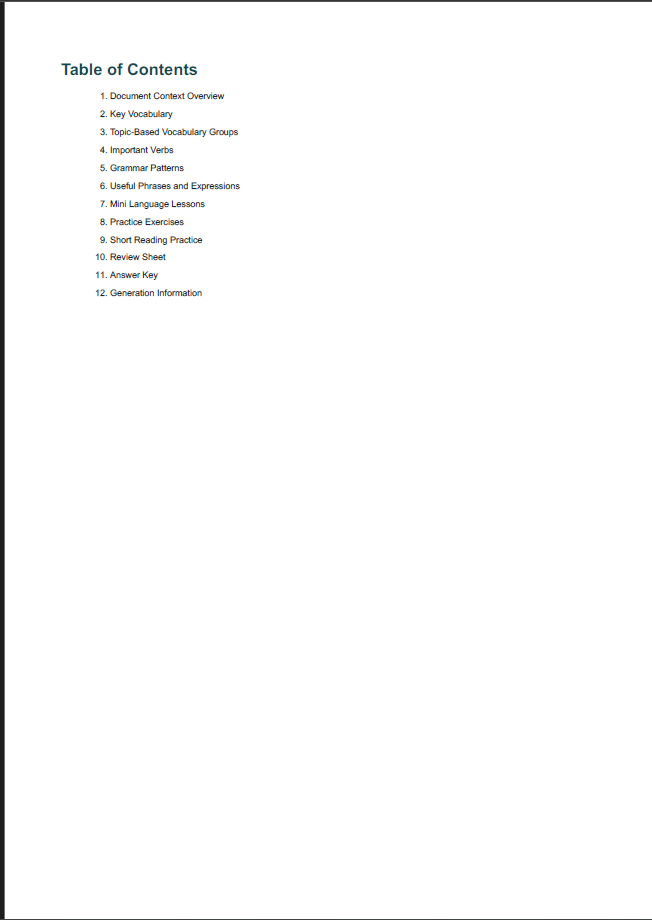
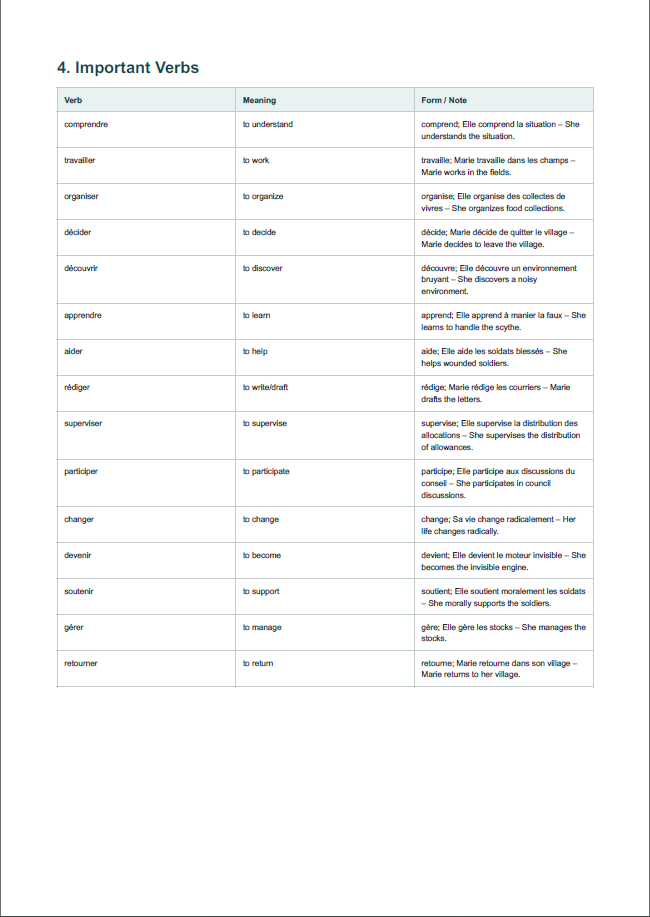
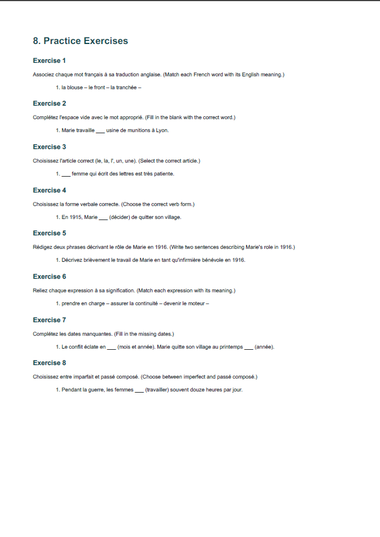

## Annex C: Future imporvements.

### Known Limitations

- The MVP focuses on static PDF learning guides, not interactive exercises.
- WeasyPrint may require native system libraries on Windows. If those are unavailable, the application falls back to PyMuPDF for PDF generation.
- The current pipeline truncates LLM input to a maximum configured character length for the MVP.
- No database is implemented; storage is local file based.
- Target language only limited to French.

### Future Improvements

- Solve the limitations above.
- Improve large-document handling by processing multiple chunks through the LLM layer.

## Annex D: Acknowledgement.

We would like to acknowledge usage of generative AI in the process of development of this software. We hope that this product brings value to the users and be regarded as a useful tool for language learners.